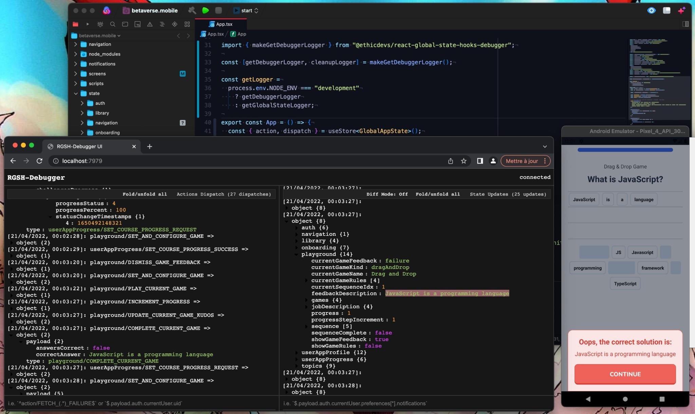

# `react-global-state-hooks-debugger`

[](https://www.npmjs.com/package/react-global-state-hooks-debugger)
[](https://github.com/EthicDevs/react-global-state-hooks-debugger/blob/master/LICENSE)
[](https://travis-ci.com/EthicDevs/react-global-state-hooks-debugger)
[](https://isitmaintained.com/project/EthicDevs/react-global-state-hooks-debugger)
[](https://isitmaintained.com/project/EthicDevs/react-global-state-hooks-debugger)

A small WebSocket based debugger for use with the [react-global-state-hooks](https://github.com/EthicDevs/react-global-state-hooks) library.



## Installation

```shell
$ yarn add @ethicdevs/react-global-state-hooks-debugger
# or
$ npm i @ethicdevs/react-global-state-hooks-debugger
```

## Usage

Launch the debugger in a new terminal tab, reload your application (react-native reload, page refresh, for example), open the debugger browser UI, enjoy!

```bash
$ yarn rgsh-debugger
# ... => http://localhost:7979
```

then in the `App` component where you provide the `GlobalStateContext` add something like this:

```ts
+ import { makeGetDebuggerLogger } from "@ethicdevs/react-global-state-hooks-debugger";

+ const getDebuggerLogger = makeGetDebuggerLogger({
+   wsUri: 'ws://localhost:8080', // default: ws://10.0.2.2 (so it works with react-native on remote device by default)
+ });

+ const getLogger = process.env.NODE_ENV === 'development'
+   ? getDebuggerLogger
+   : getCustomLogger; // | undefined to use built-in getConsoleLogger

const AppWithProviders = () => {

  return (
    <>
      <GlobalStateProvider
        initialState={initialState}
+       getLogger={getLogger}
        rootReducer={
          rootReducer as unknown as Reducer<FluxBaseState, FluxStandardAction>
        }
      >
        <AuthProvider>
          <AppearanceProvider>
            <App />
          </AppearanceProvider>
        </AuthProvider>
      </GlobalStateProvider>
    </>
  );
};
```

## License

[MIT](https://github.com/EthicDevs/react-global-state-hooks-debugger/blob/master/LICENSE)
